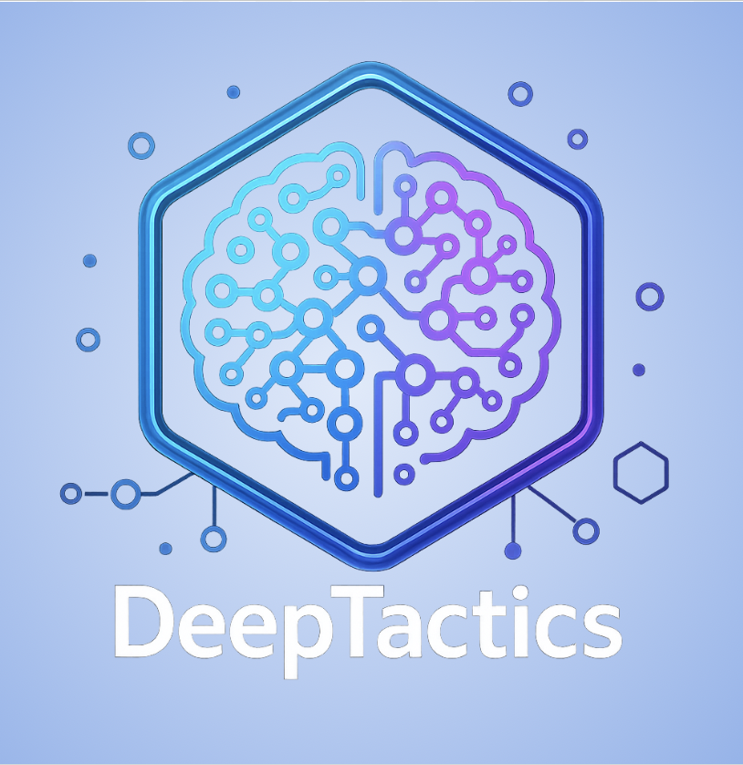
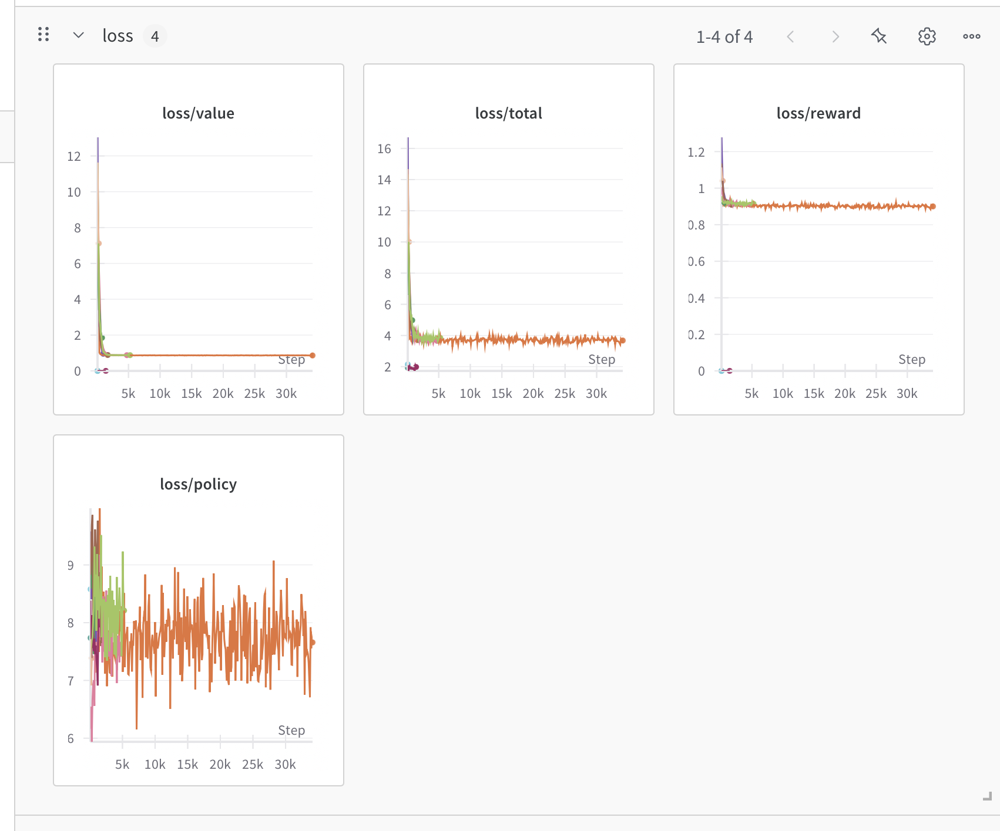

# DP-MuZero: Deep Policy MuZero Implementation

<div align="center">

[](https://opensource.org/licenses/MIT)



</div>

<details>
<summary><b>📋 Table of Contents</b></summary>

- [DP-MuZero: Deep Policy MuZero Implementation](#dp-muzero-deep-policy-muzero-implementation)
  - [Description](#description)
  - [Features](#features)
  - [Architecture](#architecture)
  - [Getting Started](#getting-started)
    - [Prerequisites](#prerequisites)
    - [Installation](#installation)
    - [Weights \& Biases Setup](#weights--biases-setup)
  - [Usage](#usage)
    - [Running with Docker Compose](#running-with-docker-compose)
    - [Accessing the Application](#accessing-the-application)
  - [Training Visualization](#training-visualization)
  - [Testing](#testing)
  - [Development](#development)
    - [Code Style](#code-style)
  - [Team](#team)
  - [IDUN HPC Usage](#idun-hpc-usage)
  - [License](#license)

</details>

## Description

DP-MuZero is an implementation of the MuZero reinforcement learning algorithm for the CartPole environment. MuZero combines Monte Carlo Tree Search (MCTS) with deep neural networks to achieve superhuman performance in various domains without prior knowledge of the environment dynamics.

This project implements the core MuZero algorithm with a focus on the CartPole control problem, demonstrating how model-based reinforcement learning can be applied to classic control tasks.



*Training loss visualization from [Weights & Biases](https://wandb.ai/adisinghwork/muzero-cartpole)*

## Features

- **MuZero Algorithm Implementation**: Complete implementation of the MuZero algorithm with representation, dynamics, and prediction networks
- **CartPole Environment**: Integration with the CartPole-v1 environment from Gymnasium
- **Monte Carlo Tree Search**: Efficient MCTS implementation for action selection
- **Training Visualization**: Integration with Weights & Biases for experiment tracking
- **Docker Support**: Containerized application with separate frontend and backend services
- **Web Interface**: React frontend for visualization and interaction

## Architecture

The project consists of two main components:

1. **Backend (Python/FastAPI)**:
   - MuZero algorithm implementation
   - Environment integration
   - Training and inference API

2. **Frontend (React/TypeScript)**:
   - Visualization of training progress
   - Interactive environment for testing trained models

## Getting Started

### Prerequisites

- [Docker](https://www.docker.com/get-started) and Docker Compose
- [Git](https://git-scm.com/downloads)
- [Weights & Biases](https://wandb.ai/) account for experiment tracking

### Installation

1. Clone the repository:
   ```bash
   git clone https://github.com/CogitoNTNU/DeepTactics-Muzero.git
   cd DeepTactics-Muzero
   ```

2. Build and start the containers:
   ```bash
   docker compose up --build
   ```

### Weights & Biases Setup

1. Install wandb:
   ```bash
   pip install wandb
   ```

2. Login to wandb (you'll need to provide your API key):
   ```bash
   wandb login
   ```

3. The project uses wandb to track:
   - Model gradients and parameters
   - Training losses (value, reward, policy, total)
   - Learning rate
   - Game statistics (episode rewards and lengths)
   - Training configuration

## Usage

### Running with Docker Compose

The easiest way to run the project is using Docker Compose:

```bash
docker compose up --build
```

This will:
1. Build the backend container with the MuZero implementation
2. Build the frontend container with the React application
3. Start both services with the appropriate networking

### Accessing the Application

- Frontend: http://localhost:9135
- Backend API: http://localhost:9135/api/ping (proxied through nginx)

## Training Visualization

Training progress can be monitored in real-time through the Weights & Biases dashboard. The implementation tracks:

- Total loss and component losses (value, reward, policy)
- Model gradients and parameters
- Episode rewards and lengths
- Learning rate changes

Visit [https://wandb.ai/adisinghwork/muzero-cartpole](https://wandb.ai/adisinghwork/muzero-cartpole) to view training metrics.

## Testing

To run the test suite:

```bash
docker compose run backend python -m pytest
```

For quick local testing without rebuilding the Docker image:

```bash
pytest backend/tests
```

## Development

### Code Style

When contributing to the project, please use type hinting in all methods:

```python
import numpy as np
import torch

def dummy_fun(a: int, b: np.ndarray, c: torch.Tensor) -> list[int]:
    pass
```

## Team

This project was developed by the following contributors:

<table align="center">
    <tr>
        <td align="center">
            <a href="https://github.com/ChristianFredrikJohnsen">
              <br />
              <sub><b>ChristianFredrikJohnsen</b></sub>
            </a>
        </td>
        <td align="center">
            <a href="https://github.com/ludvigovrevik">
              <br />
              <sub><b>ludvigovrevik</b></sub>
            </a>
        </td>
        <td align="center">
            <a href="https://github.com/Eiriksol">
              <br />
              <sub><b>Eiriksol</b></sub>
            </a>
        </td>
        <td align="center">
            <a href="https://github.com/kristiancarlenius">
              <br />
              <sub><b>kristiancarlenius</b></sub>
            </a>
        </td>
    </tr>
    <tr>
        <td align="center">
            <a href="https://github.com/BrageHK">
              <br />
              <sub><b>BrageHK</b></sub>
            </a>
        </td>
        <td align="center">
            <a href="https://github.com/adisinghstudent">
              <br />
              <sub><b>adisinghstudent</b></sub>
            </a>
        </td>
        <td align="center">
            <a href="https://github.com/Nicolai9897">
              <br />
              <sub><b>Nicolai9897</b></sub>
            </a>
        </td>
        <td align="center">
            <a href="https://github.com/Vegardhgr">
              <br />
              <sub><b>Vegardhgr</b></sub>
            </a>
        </td>
    </tr>
    <tr>
        <td align="center">
            <a href="https://github.com/SverreNystad">
              <br />
              <sub><b>SverreNystad</b></sub>
            </a>
        </td>
        <td></td>
        <td></td>
        <td></td>
    </tr>
</table>

## IDUN HPC Usage

For users with access to NTNU's IDUN supercomputer:

```bash
# Add your GitHub SSH key to the agent
ssh-add ~/.ssh/your_github_key

# Connect to IDUN
ssh -A idun.hpc.ntnu.no

# Test GitHub connectivity
ssh -T git@github.com

# Submit a job using the provided SLURM scripts
sbatch job.slurm
```

## License

Distributed under the MIT License. See `LICENSE` for more information.
